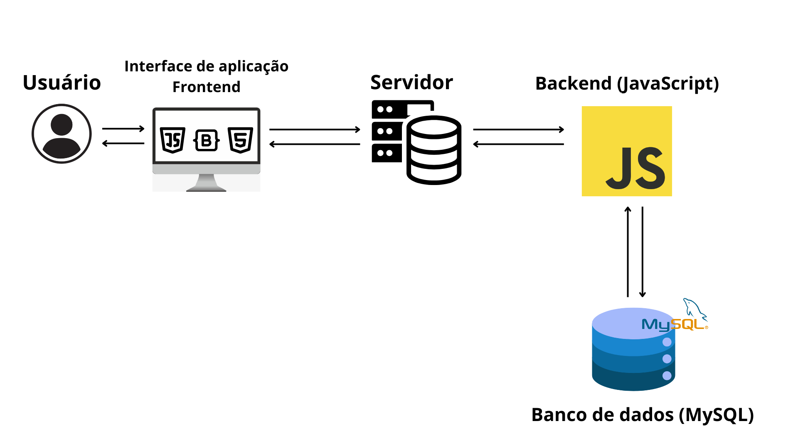
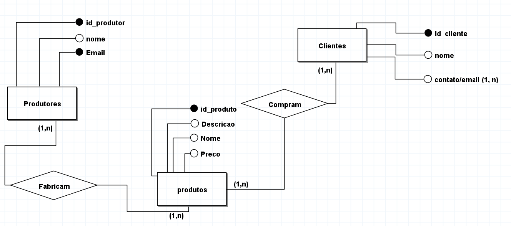
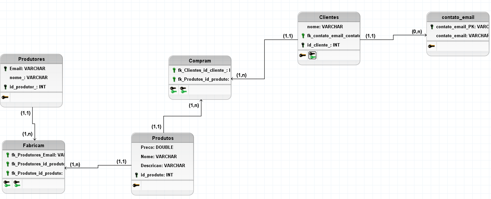

## 4. Projeto da Solução

Pré-requisitos: <a href="3-Especificação.md"> Especificação do Projeto (Requisitos do Software) </a>

## 4.1. Arquitetura da Solução

A arquitetura do sistema **EcoArtes** foi desenvolvida com o objetivo de criar uma plataforma simples, acessível e eficiente, capaz de conectar usuários a produtos sustentáveis e conteúdos educativos de maneira fluida. A aplicação é composta por quatro camadas principais: **Usuário**, **Frontend**, **Servidor com Backend em JavaScript**, e **Banco de Dados Relacional MySQL**.

### Módulos e Tecnologias da Solução

#### 1. Usuário (Cliente/Browser)
- **Descrição:** Representa o ponto de acesso do sistema. O usuário final acessa a plataforma a partir de navegadores modernos.  
- **Função:** Interagir com a interface gráfica, visualizar produtos, consumir tutoriais, navegar pelas seções e realizar ações como compras e cadastros.

---

#### 2. Interface de Aplicação (Frontend)
- **Tecnologias:**
  - **HTML5:** Estrutura semântica das páginas.
  - **CSS3:** Estilização visual.
  - **JavaScript:** Lógica e interatividade no lado do cliente.
  - **Bootstrap:** Framework CSS para design responsivo e componentes prontos.

- **Função:**
  - Exibir os conteúdos da aplicação de forma amigável e acessível.
  - Garantir responsividade e usabilidade.
  - Gerenciar interações como filtros, formulários e visualização de produtos.

---

#### 3. Servidor e Backend (JavaScript)
- **Tecnologias:**
  - JavaScript no backend (ex: Node.js ou solução similar).
  - HTTP/REST como protocolo de comunicação entre frontend e backend.

- **Função:**
  - Processar requisições feitas pelo frontend.
  - Realizar validações de dados e regras de negócio.
  - Servir os dados dinâmicos (produtos, tutoriais, usuários) vindos do banco.
  - Garantir segurança e controle de acesso.

---

#### 4. Banco de Dados (MySQL)
- **Tecnologia:** MySQL (Sistema Gerenciador de Banco de Dados Relacional)

- **Função:**
  - Armazenar dados persistentes do sistema como:
    - Produtos
    - Categorias
    - Usuários
    - Tutoriais
    - Pedidos e histórico
  - Permitir consultas otimizadas e seguras por parte do backend.
  - Garantir integridade referencial e escalabilidade futura.
 

### 4.2. Wireframes/Mockups de telas

### Página Principal
 
Página que exibe um carousel com Guias e Anúncios, e produtos em promoção/promovidos do sistema.

### Página de Cadastro de Usuário
 
O usuário preenche os campos e seleciona se é uma conta "Cliente" ou uma conta "Proprietário", que têm funções diferentes no sistema.

### Página de Log-in
 
O usuário preenche os campos para logar em sua conta.

### Página de Produtos
 
Página que exibe os produtos a venda, com opção de adiciona-los ao carrinho ou ver mais informações, além de uma barra de busca e botão de filtros para encontrar o produto desejado.

### Página do Produto
 
Página exibindo informações sobre o produto selecionado, com uma maneira de adiciona-lo ao carrinho.

### Página de Finalização de Compra
 
Página que exibe o carrinho do usuário na sessão atual, com todos seus itens e valor total, com a opção de efetuar o pagamento.

### Página da Guia
 

### Página de Gerenciamento de Produtos
 
Para os usuários Proprietários, podem selecionar, adicionar ou remover seus produtos.

## Modelo ER

#### 4.3.1 Modelo ER

#### 4.3.2 Esquema Relacional

#### 4.3.3 Modelo Físico

<code>

CREATE TABLE Produtores (
    Email VARCHAR,
    nome_ VARCHAR,
    id_produtor_ INT,
    PRIMARY KEY (Email, id_produtor_)
);

CREATE TABLE Produtos (
    Preco DOUBLE,
    Nome VARCHAR,
    Descricao VARCHAR,
    id_produto INT PRIMARY KEY
);

CREATE TABLE Clientes (
    nome VARCHAR,
    fk_contato_email_contato_email_PK VARCHAR,
    id_cliente_ INT PRIMARY KEY
);

CREATE TABLE contato_email (
    contato_email_PK VARCHAR NOT NULL PRIMARY KEY,
    contato_email VARCHAR
);

CREATE TABLE Fabricam (
    fk_Produtores_Email VARCHAR,
    fk_Produtores_id_produtor_ INT,
    fk_Produtos_id_produto INT
);

CREATE TABLE Compram (
    fk_Clientes_id_cliente_ INT,
    fk_Produtos_id_produto INT
);

</code>

### 4.4. Tecnologias

| **Dimensão**   | **Tecnologia**  |
| ---            | ---             |
| SGBD           | MySQL           |
| Front end      | HTML + CSS + JS + Bootstrap |
| Back end       | Node.js + Express|
| Biblioteca | Bootstrap|
| Framework back-end | Express.js |
| Ferramentas de desenvolvimento | VS Code, Git, GitHub    |

