# 5. Interface do Sistema

Pré-requisitos: <a href="4-Projeto-Solucao.md"> Projeto da Solução</a>

## 5.1. Tela principal do sistema

A tela principal do sistema com um conjunto de produtos e tutoriais exibidos que podem ser interagidos, além de links de navegação para página de produtos, log-in e carrinho.

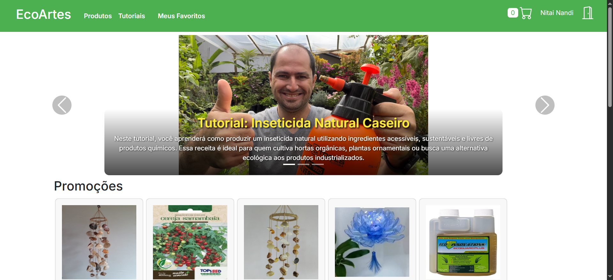

Ao selecionar um item em oferta, é exibido um pop-up com mais informações sobre.

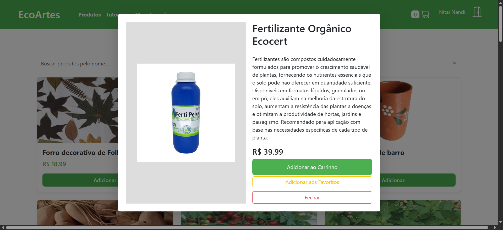

## 5.2. Telas de Cadastro e Log-in

A tela em que você pode se cadastrar no sistema como um de dois tipos de usuários.

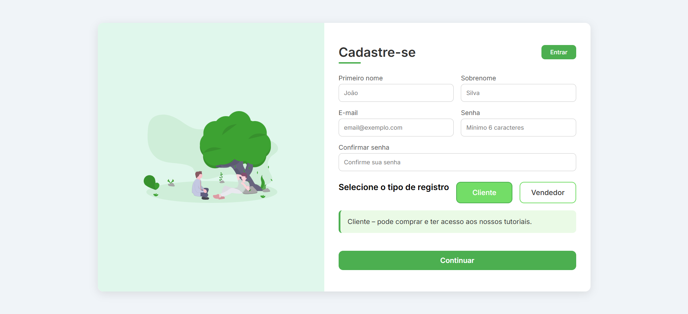

A tela em que você pode se autenticar no sistema como um de dois tipos de usuários.

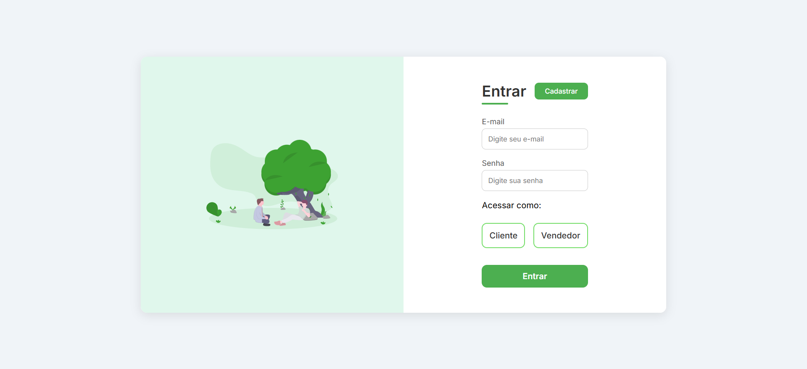

## 5.3. Tela de lista de produtos

Uma listagem com opções de filtro e pesquisa de todos os produtos em oferta no sistema.

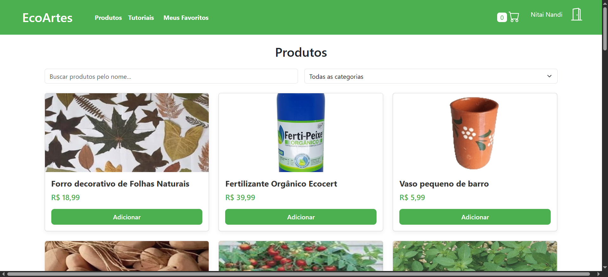

## 5.4. Tela de lista de produtos favoritos

Uma listagem com opções de filtro e pesquisa dos produtos que o usuário atual marcou como favorito.

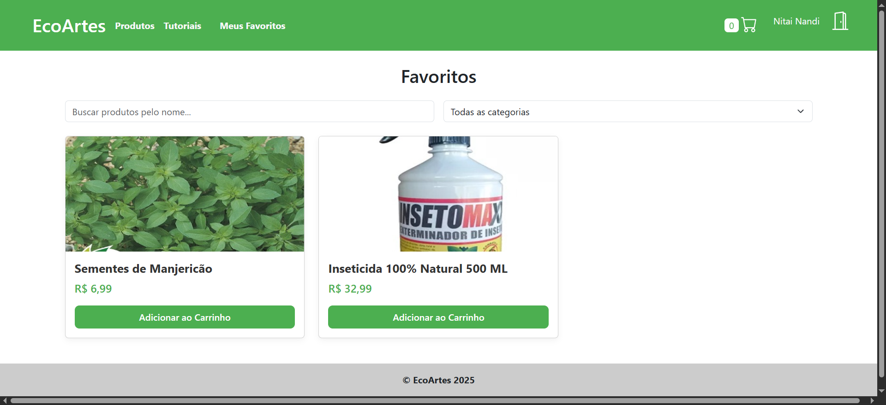

## 5.5. Tela de Tutoriais

Uma tela que exibe os tutoriais registrados no sistema (estáticos).

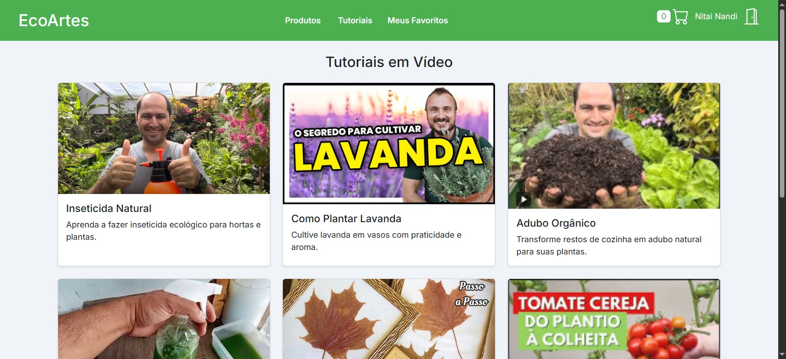

### 5.5.1

Ao selecionar um tutorial da home page ou da página de tutoriais, é exibido mais informações sobre.

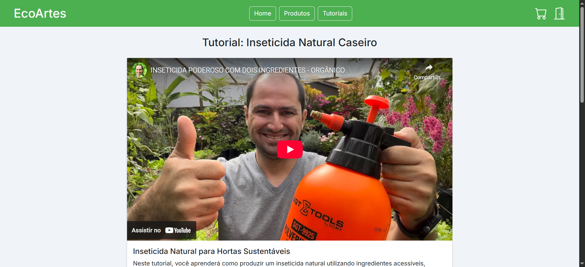

## 5.6. Tela de Finalização de Compra

Após adicionar itens ao carrinho, serão exibidos na página de finalização de compra, com opções de alterar quantidades ou remover produtos e fazer o pagamento.

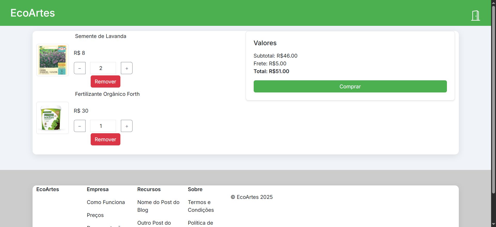

## 5.7. Tela de Gerenciamento de Produtos

Para usuários empreendedores, a página de produtos é substituida pela página de "meus produtos", onde ele pode visualizar, cadastrar, editar e remover seus produtos.

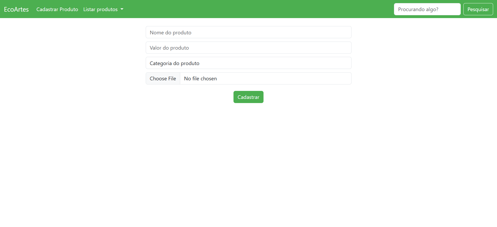

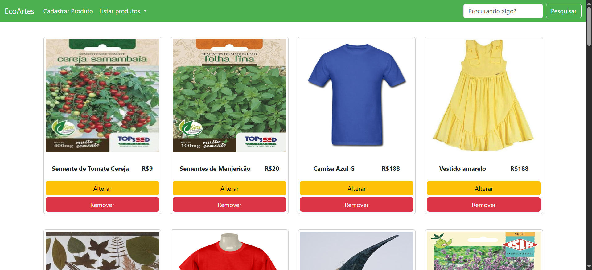
